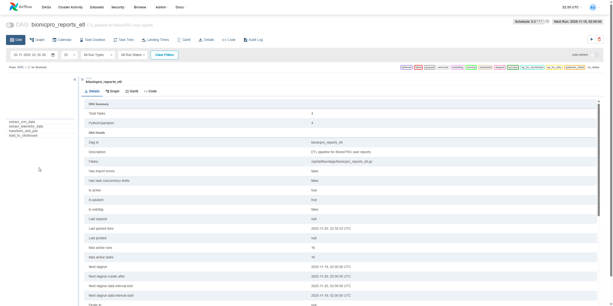
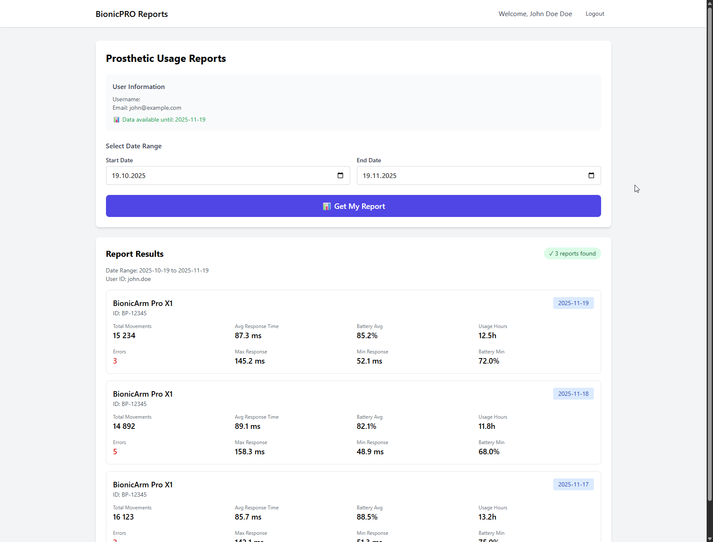
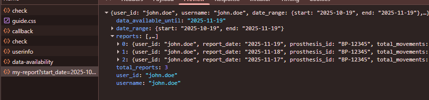
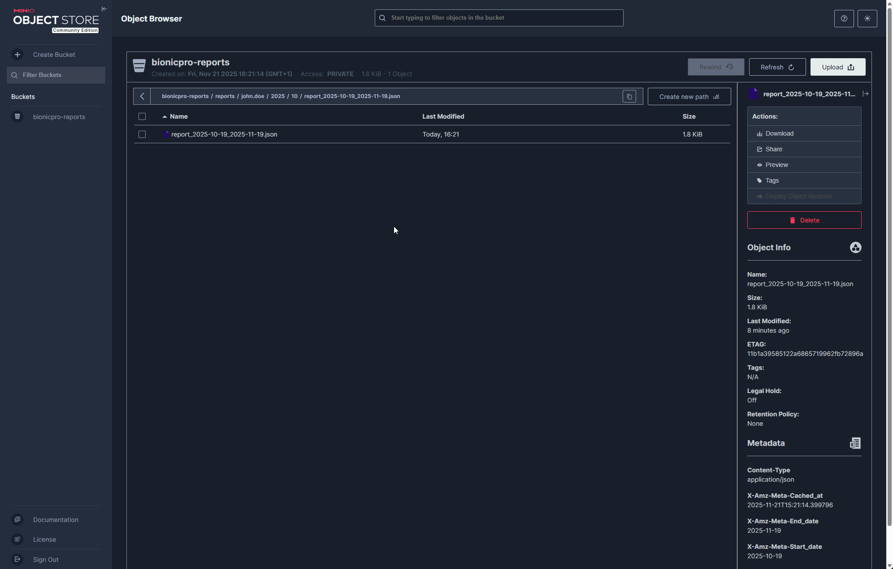
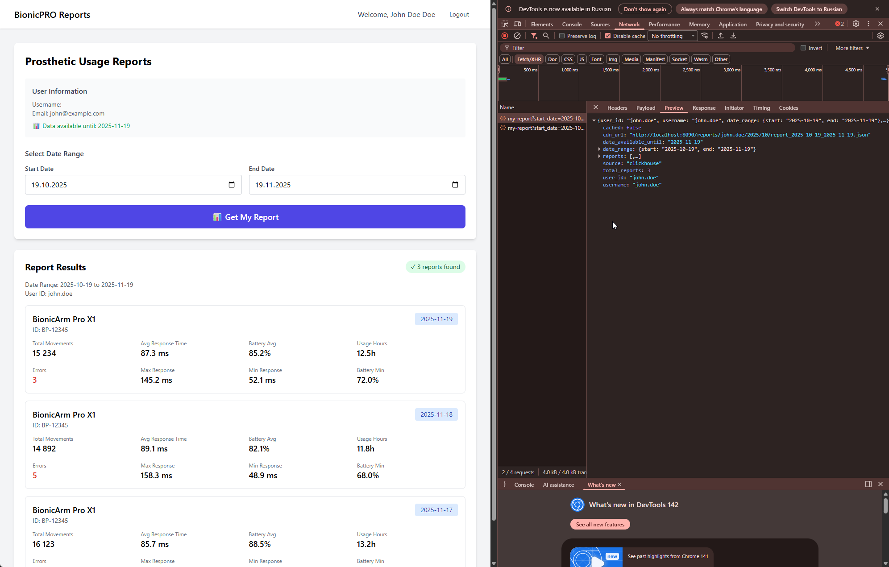
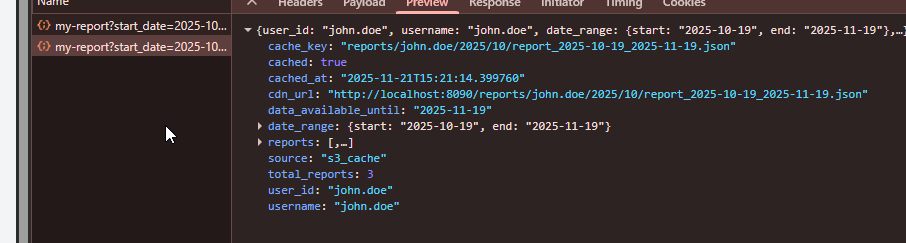

# BionicPRO - Enterprise-Ready Архитектура

## 📋 Обзор решения

Реализована полнофункциональная enterprise-платформа для управления бионическими протезами с тремя ключевыми модулями:

### 🔐 Assignment 1: Безопасность (Security)
1. **PKCE (Proof Key for Code Exchange)** - защита от перехвата authorization code
2. **Backend for Frontend (BFF)** - токены изолированы от фронтенда
3. **LDAP Federation** - поддержка пользователей из разных стран
4. **MFA через OTP** - обязательная двухфакторная аутентификация
5. **Яндекс ID** - интеграция внешнего IdP

### 📊 Assignment 2: Отчёты и ETL (Reports & Analytics)
1. **Apache Airflow** - оркестрация ETL процессов по расписанию
2. **ClickHouse OLAP** - аналитическая БД для отчётов
3. **Reports API** - REST API с контролем доступа
4. **Data Mart** - агрегация телеметрии протезов и CRM данных
5. **Frontend Integration** - UI для генерации отчётов

### ⚡ Assignment 3: Кеширование и CDN (Performance)
1. **MinIO (S3)** - объектное хранилище для отчётов
2. **Nginx CDN** - reverse proxy с кешированием
3. **Двухуровневое кеширование** - S3 (долгосрочное) + Nginx (быстрое)
4. **Cache Invalidation** - механизм обновления кеша после ETL
5. **Снижение нагрузки на OLAP** - до 90% запросов обслуживаются из кеша

## 🚀 Быстрый старт

### Запуск одной командой (рекомендуется)

```bash
git clone https://github.com/Yandex-Practicum/architecture-bionicpro.git
cd architecture-bionicpro-s9
make init
```

## 📚 Команды Makefile

### Основные команды

```bash
make help         # Показать все доступные команды
make init         # ⭐ Полная автоматическая установка (РЕКОМЕНДУЕТСЯ)
make start        # Альтернатива для init
```

### Управление сервисами

```bash
make build        # Собрать Docker образы
make up           # Запустить сервисы
make down         # Остановить сервисы
make restart      # Перезапустить сервисы
make clean        # Очистить данные и volumes
```

### Проверка и мониторинг

```bash
make check        # Проверить доступность всех сервисов
make check-ldap   # Проверить LDAP пользователей и группы
make check-auth   # Проверить API аутентификации
make logs         # Просмотр логов всех сервисов
make monitor      # Мониторинг активных сессий
```

### Логи отдельных сервисов

```bash
make logs-keycloak    # Логи Keycloak
make logs-auth        # Логи bionicpro-auth
make logs-frontend    # Логи frontend
make logs-ldap        # Логи OpenLDAP
```

### Переинициализация

```bash
make sync-ldap        # Синхронизировать LDAP пользователей с Keycloak
make reinit-ldap      # Перезагрузить данные LDAP
make reinit-keycloak  # Перепроверить Keycloak
make reinit-all       # Полная переинициализация
```

### Быстрый перезапуск отдельных сервисов

```bash
make restart-auth       # Перезапустить bionicpro-auth
make restart-frontend   # Перезапустить frontend
make restart-keycloak   # Перезапустить Keycloak
```

## 🔗 URL сервисов

После запуска `make init` доступны:

**Assignment 1 (Security):**
- **Frontend**: http://localhost:3000
- **Keycloak**: http://localhost:8080 (admin / admin)
- **BionicPRO Auth API**: http://localhost:8000
- **phpLDAPadmin**: http://localhost:6443

**Assignment 2 (Reports & ETL):**
- **Airflow UI**: http://localhost:8081 (admin / admin)
- **ClickHouse**: http://localhost:8123
- **Reports API**: http://localhost:8002 (доступ через BFF)

**Assignment 3 (S3 & CDN):**
- **MinIO Console**: http://localhost:9001 (minioadmin / minioadmin)
- **MinIO S3 API**: http://localhost:9002
- **Nginx CDN**: http://localhost:8090

## 👤 Тестовые пользователи LDAP

- **john.doe** / password (роль: prothetic_user)
- **jane.smith** / password (роль: user)
- **alex.johnson** / password (роль: prothetic_user)

> **Примечание**: При первом входе потребуется настроить OTP (двухфакторную аутентификацию). Отсканируйте QR-код в приложении Google Authenticator или FreeOTP.

## 🏗️ Технологический стек

**Assignment 1 (Security):**
- **Frontend**: React + TypeScript + PKCE
- **Backend (BFF)**: Python (FastAPI)
- **IAM**: Keycloak + OpenLDAP Federation
- **MFA**: OTP (Google Authenticator / FreeOTP)

**Assignment 2 (Reports & ETL):**
- **ETL**: Apache Airflow
- **OLAP DB**: ClickHouse
- **Reports API**: Python (FastAPI)

**Assignment 3 (Caching):**
- **Object Storage**: MinIO (S3-compatible)
- **CDN**: Nginx (reverse proxy + cache)
- **S3 Client**: boto3

**Infrastructure:**
- Docker Compose
- Multi-stage builds

## 📁 Структура проекта

```
bionicpro-s9/
├── bionicpro-auth/        # BFF сервис (Python/FastAPI) - Assignment 1
├── bionicpro-reports/     # Reports API (Python/FastAPI) - Assignment 2 & 3
│   ├── s3_client.py       # Клиент для MinIO/S3 - Assignment 3
│   ├── main.py            # API endpoints с S3 кешированием
│   └── ...
├── frontend/              # React приложение с PKCE
├── keycloak/              # Конфигурация Keycloak
├── ldap/                  # LDAP данные (config.ldif)
├── airflow/               # Airflow DAGs и конфигурация - Assignment 2
│   ├── dags/              # ETL процессы
│   └── requirements.txt   # Python зависимости для DAGs
├── clickhouse/            # ClickHouse схемы - Assignment 2
│   └── init/              # SQL скрипты инициализации
├── nginx/                 # Nginx CDN конфигурация - Assignment 3
│   └── nginx.conf         # Reverse proxy с кешированием
├── diagrams/              # C4 диаграммы архитектуры
├── scripts/               # Скрипты автоматической инициализации
├── Makefile               # Команды управления
└── docker-compose.yaml    # Оркестрация сервисов
```

## 🔐 Компоненты безопасности

### 1. PKCE Flow
- Frontend генерирует `code_verifier` и `code_challenge`
- Защита от перехвата authorization code

### 2. BFF (Backend for Frontend)
- Токены хранятся только на бэкенде
- Frontend получает HTTP-only Secure cookie
- Автоматическое обновление токенов
- Ротация сессий

### 3. LDAP Federation
- Интеграция с OpenLDAP
- Маппинг ролей между представительствами

### 4. MFA
- OTP через Google Authenticator / FreeOTP
- Настраивается в Keycloak Admin Console

### 5. Яндекс ID (не работает, т.к. Яндекс не поддерживает работу с oidc)
- Identity Brokering через OpenID Connect
- См. `keycloak/yandex-id-setup.md`

## 📦 Результаты Assignment 1

### Выполненные задачи

✅ **Задача 1.1**: Архитектурное решение
- Диаграмма C4 в [BionicPro_auth_C4.drawio.xml](diagrams/BionicPro_auth_C4.drawio.xml)
- Унификация доступа через внешние IdP
- Локальное хранение персональных данных
- Безопасная работа с токенами

✅ **Задача 1.2**: PKCE реализация
- Frontend генерирует `code_verifier` и `code_challenge`
- Keycloak настроен на PKCE
- Защита от перехвата authorization code

✅ **Задача 1.3**: Backend for Frontend (BFF)
- Новый сервис `bionicpro-auth` (Python/FastAPI)
- Токены хранятся только на бэкенде
- HTTP-only Secure cookies для сессий
- Автоматическое обновление access token
- Ротация сессий для защиты от session fixation

✅ **Задача 1.4**: LDAP Federation
- OpenLDAP развернут с тестовыми пользователями
- Keycloak интегрирован с LDAP
- User Attribute Mappers настроены
- Маппинг групп и ролей работает

✅ **Задача 1.5**: Multi-Factor Authentication (MFA)
- OTP обязателен для всех пользователей
- Поддержка Google Authenticator и FreeOTP
- Настройка при первом входе

✅ **Задача 1.6**: Яндекс ID Integration
- Identity Brokering через OpenID Connect
- Конфигурация в [yandex-id-setup.md](keycloak/yandex-id-setup.md)
- Запрос согласия на использование данных

### Артефакты

- **Код PKCE**: `frontend/src/utils/pkce.ts`
- **BFF сервис**: `bionicpro-auth/`
- **Frontend изменения**: `frontend/src/`
- **LDAP конфигурация**: `ldap/config.ldif`
- **Keycloak realm**: `keycloak/realm-export.json`
- **Финальная конфигурация**: `keycloak/keycloak-results-export.json`

---

## 📊 Assignment 2: Сервис отчётов

### 📋 Задача

Разработать ETL-сервис для генерации отчётов о работе протезов, объединяющий данные телеметрии и CRM-системы.

### 🏗️ Компоненты решения

#### 1. Apache Airflow - оркестрация ETL
- **Контейнер**: `bionicpro-airflow-webserver`, `bionicpro-airflow-scheduler`
- **URL**: http://localhost:8081 (admin/admin)
- **DAG**: `bionicpro_reports_etl` - ежедневный запуск
- **Функции**:
  - Извлечение данных из CRM DB (Oracle) и Telemetry DB (PostgreSQL)
  - Трансформация: группировка по пользователям
  - Загрузка в ClickHouse

#### 2. ClickHouse OLAP База
- **Контейнер**: `bionicpro-clickhouse`
- **URL**: http://localhost:8123
- **База**: `bionicpro`
- **Витрина**: `user_reports` - агрегированные данные по пользователям
- **Схема**: оптимизирована для быстрых запросов по `user_id` и `report_date`

#### 3. Reports API Service
- **Контейнер**: `bionicpro-reports`
- **URL**: http://localhost:8002 (внутренний)
- **Доступ через BFF**: http://localhost:8000/api/reports/...
- **Технологии**: Python + FastAPI + clickhouse-driver
- **Endpoints**:
  - `GET /api/reports/data-availability` - доступные даты
  - `GET /api/reports/my-report` - отчёты пользователя

#### 4. Frontend UI
- **Страница**: Reports Page (http://localhost:3000)
- **Функции**:
  - Выбор диапазона дат
  - Кнопка "Get My Report"
  - Визуализация метрик: движения, время отклика, батарея, ошибки
  - Защита: данные только за обработанный период

### 🔐 Безопасность и контроль доступа

#### BFF Pattern (Backend for Frontend)
```
Frontend (localhost:3000)
  ↓ Session Cookie (bionicpro_session)
BFF (localhost:8000/api/reports/*)
  ↓ Validates session, extracts user_id
  ↓ Header: X-User-ID
Reports API (bionicpro-reports:8002)
  ↓ Trusts BFF (internal Docker network)
ClickHouse (bionicpro.user_reports)
```

**Защита:**
- ✅ Cookie не доступна JavaScript (HttpOnly)
- ✅ Reports API доступен только через BFF
- ✅ User ID берётся из **аутентифицированной сессии**, не из параметров
- ✅ SQL запрос с фильтром: `WHERE user_id = '{authenticated_user_id}'`
- ✅ Каждый пользователь видит **только свои данные**

### 📸 Скриншоты решения

#### [Скриншот 1: Airflow UI - DAG bionicpro_reports_etl]


#### [Скриншот 2: Frontend - Отчёты пользователя john.doe]


#### [Скриншот 3: DevTools - Проверка контроля доступа]


### 🧪 Проверка требований

#### 1. UI-код позволяет вызвать API ✅
```typescript
// frontend/src/components/ReportPage.tsx
const response = await fetch(`http://localhost:8000/api/reports/my-report?${params}`, {
  credentials: 'include'
});
```

#### 2. Неаутентифицированный пользователь не может генерировать отчёт ✅
**Проверка:**
```bash
curl http://localhost:8000/api/reports/my-report
# Ожидаемый результат: {"detail":"Not authenticated","status_code":401}
```

#### 3. Пользователь видит только собственный отчёт ✅
**Реализация:**
- User ID извлекается из **сессии BFF** (невозможно подделать)
- Reports API получает `X-User-ID` от BFF (доверенный источник)
- SQL запрос: `WHERE user_id = '{authenticated_user_id}'`

**Проверка:**
- john.doe → 3 отчёта (BP-12345, BionicArm Pro X1)
- jane.smith → 2 отчёта (BP-23456, BionicHand Elite)
- alex.johnson → 2 отчёта (BP-34567, BionicArm Pro X2)

#### 4. Запросы идут в OLAP базу ✅
```python
# bionicpro-reports/clickhouse_client.py
reports = ch_client.get_user_reports(user_id, start_date, end_date)
# → SELECT * FROM bionicpro.user_reports WHERE user_id = '...'
```

#### 5. Генерация только за обработанный период ✅
```python
# bionicpro-reports/main.py
latest_data_date = ch_client.get_latest_data_date()
if end_date > latest_data_date:
    raise HTTPException(400, detail=f"Data only available until {latest_data_date}")
```

### 📦 Артефакты Assignment 2

- **Диаграмма C4**: `diagrams/BionicPro_etl_C4_t2.drawio.xml`
- **Airflow DAG**: `airflow/dags/bionicpro_reports_etl.py`
- **Airflow конфиг**: `airflow/requirements.txt`
- **ClickHouse схемы**: `clickhouse/init/*.sql`
  - `01_create_database.sql` - создание БД
  - `02_create_user_reports_table.sql` - витрина отчётов
  - `03_insert_test_data.sql` - тестовые данные
- **Reports API сервис**: `bionicpro-reports/`
  - `main.py` - FastAPI endpoints
  - `auth.py` - контроль доступа через BFF
  - `clickhouse_client.py` - клиент для ClickHouse
  - `config.py` - конфигурация
- **Frontend обновления**: `frontend/src/components/ReportPage.tsx`
- **BFF proxy endpoints**: `bionicpro-auth/main.py` (новые endpoints для Reports API)

### ✅ Выполненные задачи

✅ **Задача 2.1**: Архитектура ETL решения  
✅ **Задача 2.2**: Airflow DAG с расписанием  
✅ **Задача 2.3**: Backend API для отчётов  
✅ **Задача 2.4**: Контроль доступа (только свои отчёты)  
✅ **Задача 2.5**: UI кнопка для получения отчётов

---

## 🚀 Assignment 3: Снижение нагрузки через S3 и CDN

### 📋 Задача

Снизить нагрузку на ClickHouse OLAP базу за счет кеширования сгенерированных отчётов в S3 и раздачи через CDN.

### 🏗️ Архитектура кеширования

```
User Request
  ↓
Reports API (bionicpro-reports)
  ↓
  ├──> Check S3 (MinIO)
  │     ├─ Cache HIT  → Return CDN URL ✅ (быстро!)
  │     └─ Cache MISS → ↓
  │
  ├──> Query ClickHouse (OLAP) ⏱️
  │     ↓
  ├──> Save to S3
  │     ↓
  └──> Return CDN URL
        ↓
Nginx CDN (Reverse Proxy + Cache)
  ↓
MinIO (S3 Object Storage)
```

### 🔧 Компоненты решения

#### 1. MinIO (S3-compatible storage)
- **Контейнер**: `bionicpro-minio`
- **API**: http://localhost:9002 (внешний порт, внутри контейнера 9000)
- **Console**: http://localhost:9001 (minioadmin/minioadmin)
- **Bucket**: `bionicpro-reports`
- **Структура хранения**:
  ```
  reports/{user_id}/{year}/{month}/report_{start}_{end}.json
  ```

#### 2. Nginx CDN (Reverse Proxy с кешированием)
- **Контейнер**: `bionicpro-nginx-cdn`
- **URL**: http://localhost:8090
- **Функции**:
  - Reverse proxy к MinIO
  - Кеширование статических файлов (60 минут)
  - Заголовок `X-Cache-Status` для отладки
  - CORS для frontend
- **Конфигурация**: `nginx/nginx.conf`

#### 3. Reports API с S3 логикой
**Обновлен**: `bionicpro-reports/`

**Новые файлы:**
- `s3_client.py` - клиент для работы с MinIO/S3
- Обновлен `main.py` - логика кеширования
- Обновлен `config.py` - S3 и CDN настройки

**Логика работы:**
```python
# 1. Проверка кеша
cached = s3_cache.get_cached_report(user_id, start, end)
if cached:
    return {"cdn_url": "...", "cached": True}

# 2. Генерация из ClickHouse
reports = ch_client.get_user_reports(user_id, start, end)

# 3. Сохранение в S3
s3_key = s3_cache.save_report(user_id, start, end, reports)
cdn_url = s3_cache.get_cdn_url(s3_key)

# 4. Возврат CDN URL
return {"cdn_url": cdn_url, "cached": False}
```

### 🔄 Механизм обновления кеша

#### Двухуровневое кеширование

**Уровень 1: S3 (MinIO)** - долгосрочное хранилище отчётов  
**Уровень 2: Nginx CDN** - быстрый кеш для раздачи

#### Инвалидация при обновлении данных

**Когда инвалидировать:**
- После запуска Airflow DAG (новые данные в ClickHouse)
- По расписанию (ежедневно после ETL)
- Вручную через API

**Методы инвалидации:**

1. **Удаление из S3 (Python API):**
   ```python
   # Полная инвалидация пользователя
   s3_cache.invalidate_user_reports(user_id="john.doe")
   
   # Инвалидация конкретного месяца
   s3_cache.invalidate_user_reports(user_id="john.doe", date_prefix="2025-11")
   ```

2. **Автоматическая инвалидация Nginx CDN (TTL):**
   - `proxy_cache_valid 200 60m` - кеш живет 60 минут
   - После ETL (02:00) старые данные истекают к 03:00
   - Следующий запрос получит обновленные данные из S3

3. **Ручная очистка Nginx кеша (если нужно):**
   ```bash
   # Войти в контейнер и очистить кеш
   docker exec -it bionicpro-nginx-cdn sh -c "rm -rf /var/cache/nginx/*"
   
   # Перезагрузить Nginx
   docker-compose restart nginx-cdn
   ```

#### Стратегия обновления после ETL

```
02:00 - Airflow DAG запускается
02:30 - Новые данные в ClickHouse
02:31 - Python script удаляет старые отчёты из S3
       └─> s3_cache.invalidate_user_reports() для всех пользователей
03:00 - Nginx кеш истекает (60 мин TTL)
03:01 - Первый запрос пользователя:
       ├─> S3 cache MISS (удалён в 02:31)
       ├─> Генерация из ClickHouse (новые данные!)
       ├─> Сохранение в S3
       └─> Кеширование в Nginx CDN
```

### 🧪 Команды для проверки

```bash
# Проверить все сервисы
make check

# Проверить MinIO
curl http://localhost:9002/minio/health/live

# Проверить Nginx CDN
curl http://localhost:8090/health

# Открыть MinIO Console
open http://localhost:9001  # minioadmin/minioadmin

# Посмотреть кешированные файлы в S3
# В MinIO Console → Buckets → bionicpro-reports → reports/
```

### 📦 Артефакты Assignment 3

- **Nginx конфигурация**: `nginx/nginx.conf`
- **S3 клиент**: `bionicpro-reports/s3_client.py`
- **Обновлен Reports API**: `bionicpro-reports/main.py`
- **docker-compose**: MinIO и Nginx сервисы добавлены

---

### 📸 Скриншоты Assignment 3

#### [Скриншот 1: MinIO Console - Структура хранения отчётов в S3]


#### [Скриншот 2: DevTools - Cache HIT (второй запрос)]



---

## 🐛 Решение проблем

### Ошибки при сборке

```bash
# Если возникли ошибки TypeScript
make clean
make build

# Полная пересборка
docker-compose build --no-cache
```

### LDAP не запускается

```bash
# Пересоздать LDAP с данными
make down
sudo rm -rf ldap-data ldap-config
make init
```

### Сервисы не отвечают

```bash
# Проверить логи
make logs

# Проверить статус контейнеров
docker-compose ps

# Перезапустить всё
make restart
```